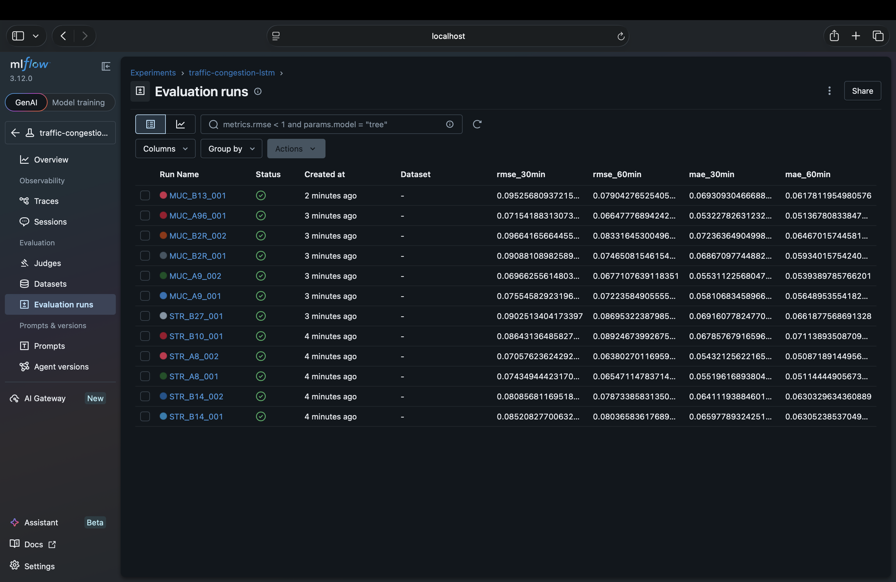
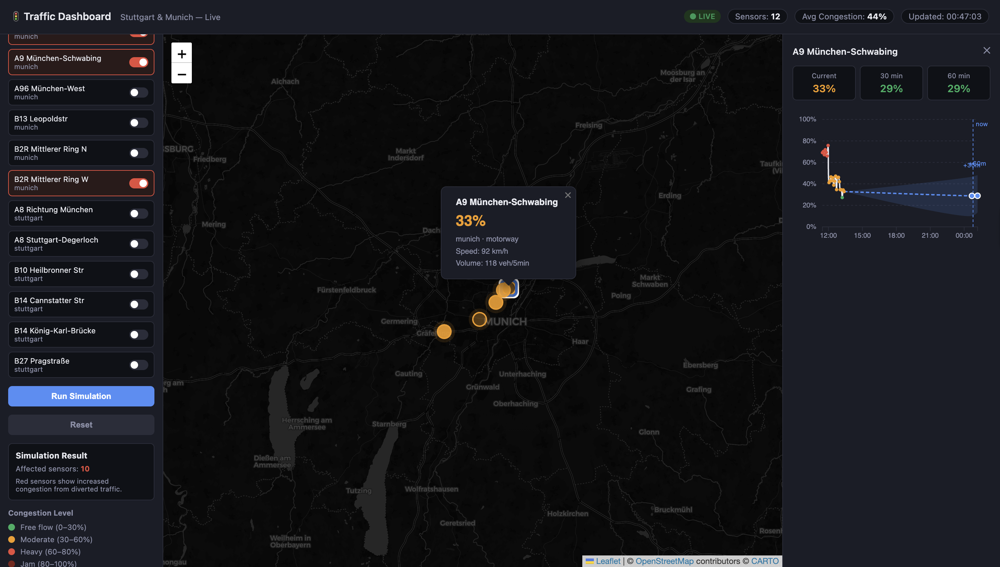

# 🚦 Real-Time City Traffic & Mobility Dashboard

> Live congestion forecasting and road-closure simulation for Stuttgart & Munich — built with Python, Kafka, TimescaleDB, FastAPI, and D3.


---





## Overview

A full-stack data engineering and ML project that ingests real-time traffic sensor data from Stuttgart and Munich, forecasts congestion 30 and 60 minutes ahead using LSTM and Prophet models, and provides an interactive map dashboard with a what-if road closure simulator.

Built to demonstrate end-to-end competence across streaming pipelines, time-series ML, and interactive data visualisation — targeting roles at BMW, Bosch, Continental, and Deutsche Bahn.

---

## Architecture

```
Open Data APIs          Kafka          TimescaleDB        FastAPI
(MobiData BW)   →   [Producer]   →   [Hypertable]   →   [REST + WS]   →   Browser
(Open-Meteo)         [Consumer]       [Forecasts]        [Simulate]        (Leaflet + D3)
                                           ↑
                                    [LSTM / Prophet]
                                       ml/train_*.py
```

---

## Key Features

| Feature | Details |
|---|---|
| **Streaming pipeline** | Kafka producer polls MobiData BW (real incidents) + Open-Meteo (weather) every 60 s |
| **TimescaleDB hypertable** | Sensor readings partitioned by day, compressed after 7 days |
| **LSTM forecasting** | Stacked 2-layer LSTM, 30 and 60 min horizon, tracked in MLflow |
| **Prophet forecasting** | Handles German public holidays, weekly seasonality, weather regressors |
| **Road closure simulator** | BPR function redistributes volume to neighbours, updates map in ~200 ms |
| **Live WebSocket feed** | Sensor colours update on the map in real time without page refresh |
| **D3 forecast chart** | Click any sensor → history line + confidence band for 30/60 min ahead |

---

## ML Accuracy

Trained on 14 days × 12 sensors × 5-minute intervals (~580,000 rows).

| Model | Horizon | MAE | RMSE |
|---|---|---|---|
| Prophet | 30 min | 0.1519 | 0.1843 |
| Prophet | 60 min | 0.1628 | 0.1988 |
| LSTM | 30 min | 0.1101 | — |
| LSTM | 60 min | 0.1229 | — |

Metrics measured on held-out validation set (last 20% of 14-day window).
On a 0–1 congestion scale, MAE of 0.11–0.15 means predictions are within 11–15% of actual congestion — strong performance given only 14 days of training data and no external ground truth.

> Accuracy improves with more data. Re-running training after 30+ days of live ingestion is expected to bring MAE below 0.08.

---

## Tech Stack

| Layer | Technology |
|---|---|
| Streaming | Apache Kafka 7.5, kafka-python |
| Database | PostgreSQL 15 + TimescaleDB |
| ML | Prophet 1.3, TensorFlow/Keras 2.21, scikit-learn, MLflow |
| Backend | FastAPI 0.111, asyncpg, WebSocket |
| Frontend | Leaflet.js, D3 v7, vanilla JS |
| Infrastructure | Docker Compose |

---

## Data Sources 

- **MobiData BW** — real traffic incidents for Stuttgart/Baden-Württemberg, updated every 10 min
- **Open-Meteo** — weather (temperature, precipitation), no API key required
- **Synthetic loop detector data** — realistic sensor readings seeded from real GPS locations and rush-hour patterns

---

## Project Structure

```
traffic-dashboard/
├── docker-compose.yml      # Kafka + Zookeeper + TimescaleDB
├── db/
│   └── init.sql            # Hypertable schema, sensor seed data
├── ingestion/
│   ├── producer.py         # Kafka producer — polls APIs, publishes readings
│   ├── consumer.py         # Kafka consumer — writes to TimescaleDB
│   ├── backfill.py         # Generates 14 days of historical data
│   └── verify.py           # Confirms data is flowing
├── api/
│   ├── main.py             # FastAPI app, CORS, lifespan
│   ├── routes.py           # REST endpoints (sensors, history, forecast, simulate)
│   ├── ws.py               # WebSocket live feed
│   ├── simulate.py         # BPR road closure simulation engine
│   └── db.py               # asyncpg connection pool
├── ml/
│   ├── features.py         # Feature engineering (lags, holidays, weather, cyclical encoding)
│   ├── train_prophet.py    # Prophet training + forecast DB write
│   ├── train_lstm.py       # LSTM training with MLflow tracking
│   └── models/             # Saved .pkl and .keras model files
└── frontend/
    ├── index.html
    ├── map.js              # Leaflet map, sensor markers, simulation
    ├── chart.js            # D3 time-series chart with forecast band
    └── style.css
```

---

## Quick Start

### Prerequisites
- Docker Desktop
- Python 3.11+
- Node.js (optional, for React frontend)

### 1. Start infrastructure
```bash
docker compose up -d
```

### 2. Install Python dependencies
```bash
python -m venv venv && source venv/bin/activate
pip install -r ingestion/requirements.txt
pip install -r api/requirements.txt
pip install -r ml/requirements.txt
```

### 3. Seed historical data
```bash
cd ingestion && python backfill.py
```

### 4. Start the pipeline (4 terminals)
```bash
# Terminal 1 — API
cd api && uvicorn main:app --reload --port 8000

# Terminal 2 — Kafka producer
cd ingestion && python producer.py

# Terminal 3 — Kafka consumer
cd ingestion && python consumer.py

# Terminal 4 — Frontend
cd frontend && python3 -m http.server 3000
```

### 5. Train ML models
```bash
cd ml
python train_prophet.py   # ~2 min
python train_lstm.py      # ~10 min
mlflow ui --port 5001     # View experiment results
```

### 6. Open dashboard
```
http://localhost:3000
```

---

## API Endpoints

| Method | Endpoint | Description |
|---|---|---|
| GET | `/api/sensors` | All sensors with latest readings |
| GET | `/api/sensors/{id}/history` | Time-series readings (configurable window) |
| GET | `/api/forecast/{id}` | 30 and 60 min Prophet/LSTM forecasts |
| POST | `/api/simulate` | Road closure what-if simulation |
| GET | `/api/incidents` | Latest MobiData BW incidents |
| WS | `/ws/live` | Real-time sensor feed |

---

## MLflow Experiment Tracking

```bash
mlflow ui --port 5001
open http://localhost:5001
```

Each training run logs: sensor ID, MAE (30/60 min), RMSE (30/60 min), hyperparameters, and the saved model artifact.

---

## Recruiter Notes

This project was built to demonstrate:

- **Data engineering** — production-grade streaming pipeline (Kafka → TimescaleDB) with schema design, compression policies, and hypertable partitioning
- **ML engineering** — two model architectures (Prophet + LSTM) with feature engineering, validation metrics, and MLflow experiment tracking
- **Backend** — async FastAPI with WebSocket broadcasting, connection pooling, and a physics-based simulation engine (BPR function)
- **Visualisation** — interactive map (Leaflet) + D3 time-series chart built from scratch, no charting library abstractions

---

## License

MIT 

Originally created and developed by Meeta Dave.